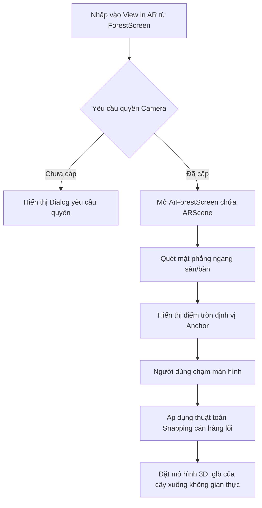

# Kế hoạch Triển khai Tính năng Xem Khu Rừng qua Công nghệ AR (Augmented Reality)

Kế hoạch này phác thảo cách tích hợp thực tế tăng cường (AR) vào màn hình Forest để người dùng có thể chiếu khu rừng của mình lên không gian thực (phòng học, bàn làm việc, sân vườn) thông qua camera điện thoại, quét mặt phẳng và đặt cây thẳng hàng ngay ngắn.

---

## Giải đáp các câu hỏi kỹ thuật của bạn

### 1. Chức năng này có làm được không?
**Hoàn toàn làm được.** Chúng ta sẽ xây dựng tính năng này trực tiếp trên ứng dụng native Android bằng bộ đôi thư viện:
- **Google ARCore**: SDK cốt lõi của Google hỗ trợ đo độ sâu, nhận diện mặt phẳng (plane detection) và theo dõi chuyển động camera.
- **Sceneview (AR Sceneview)**: Thư viện render 3D cao cấp dành cho Jetpack Compose (được viết dựa trên engine đồ họa Filament của Google). Thư viện này cung cấp sẵn Composable `ARScene` giúp chúng ta tích hợp camera stream và xử lý tương tác chạm vô cùng mượt mà.

### 2. Chức năng này cần loại ảnh/tệp tin gì?
Để đạt được trải nghiệm AR chân thực (khi bạn đi vòng quanh, cây sẽ quay các mặt tương ứng, đổ bóng chân thực xuống sàn nhà), chúng ta **không sử dụng ảnh 2D thông thường** (như PNG, JPG, WebP) mà cần sử dụng **Mô hình 3D**.
- **Định dạng tối ưu nhất**: `.glb` (định dạng nhị phân của glTF). Đây là định dạng chuẩn được ARCore và Sceneview hỗ trợ tốt nhất vì nó gói gọn cả khung lưới 3D (mesh), vân bề mặt (textures), chất liệu ánh sáng (materials) và hoạt ảnh chuyển động (animations) vào một file duy nhất cực kỳ nhẹ.
- **Trường hợp dùng ảnh 2D**: Có thể áp dụng kỹ thuật *Billboard* (vẽ ảnh phẳng 2D lên một tấm card đứng trong không gian AR tự động xoay hướng về phía camera). Tuy nhiên, cách này trông sẽ giả (giống như dựng các tấm bìa mica mỏng), không tạo được cảm giác không gian 3D thực thụ.

### 3. Bạn cần chuẩn bị mô hình 3D ở đâu?
- **Tải miễn phí từ các kho 3D nổi tiếng**:
  - **Sketchfab (sketchfab.com)**: Kho 3D lớn nhất. Bạn gõ tìm kiếm "low poly tree", chọn bộ lọc "Downloadable" và chọn các mô hình miễn phí (Creative Commons) định dạng `.gltf` hoặc `.glb`.
  - **Poly Pizza (poly.pizza)**: Rất nhiều mô hình phong cách Low-poly cực kỳ dễ thương, tối ưu hóa cực tốt cho game/mobile app. Tải trực tiếp file `.glb`.
  - **itch.io**: Tìm kiếm các gói tài nguyên 3D miễn phí (3D Nature Assets).
- **Tạo bằng AI (Khuyên dùng thử)**:
  - Hiện nay có các AI dựng mô hình 3D từ ảnh 2D hoặc từ text rất tốt như **Meshy (meshy.ai)** hoặc **Tripo3D (tripo3d.ai)**. Bạn chỉ cần up ảnh các cây hiện tại lên, AI sẽ sinh ra file 3D `.glb` tương ứng trong vài giây.
- **Tự chỉnh sửa/Export**:
  - Có thể sử dụng **Spline (spline.design)** (rất trực quan trên web) hoặc **Blender** để tự vẽ hoặc chuyển đổi các định dạng khác sang `.glb`.

---

## Chi tiết các bước triển khai (Proposed Changes)



### 1. Cấu hình Gradle & Cấp quyền Camera

#### [MODIFY] [build.gradle.kts (app)](file:///d:/Android_Dev/GreenFocus/app/build.gradle.kts)
Thêm dependencies cho ARCore và Sceneview:
```kotlin
implementation("com.google.ar:core:1.42.0")
implementation("io.github.sceneview:arsceneview:0.10.4")
```

#### [MODIFY] [AndroidManifest.xml](file:///d:/Android_Dev/GreenFocus/app/src/main/AndroidManifest.xml)
Đảm bảo đã khai báo các quyền AR và camera cần thiết:
```xml
<!-- Khai báo ARCore là tính năng tùy chọn (không chặn cài đặt trên thiết bị không có ARCore) -->
<uses-feature android:name="android.hardware.camera.ar" android:required="false" />
<meta-data android:name="com.google.ar.core" android:value="optional" />
```

### 2. Thiết lập Tài nguyên Mô hình 3D
Tạo thư mục assets và đặt mô hình vào:
- **[NEW] Directory**: `app/src/main/assets/models/`
- Thêm file `.glb` cho từng loại cây (ví dụ: `default_oak.glb`, `pine.glb`, v.v.).

### 3. Triển khai Màn hình AR Camera & Thuật toán Căn hàng lối

#### [NEW] [ArForestScreen.kt](file:///d:/Android_Dev/GreenFocus/app/src/main/java/com/example/greenfocus/ui/screen/forest/ArForestScreen.kt)
Tạo màn hình AR mới sử dụng `ARScene` để quét mặt phẳng và đặt cây.
- **Thuật toán căn hàng lối (Grid Snapping Logic)**:
  ARCore tính toán vị trí thực tế bằng mét (meters) với gốc tọa độ `(0, 0, 0)` tại vị trí khởi tạo camera.
  Khi người dùng chạm để đặt cây tại tọa độ chạm thực tế `(x, y, z)`:
  - Chúng ta sẽ thiết lập kích thước ô lưới ảo (ví dụ mỗi cây cách nhau `0.5f` mét).
  - Làm tròn giá trị `x` và `z` về bội số gần nhất của `0.5f`:
    $$x_{\text{grid}} = \text{round}(x / 0.5f) \times 0.5f$$
    $$z_{\text{grid}} = \text{round}(z / 0.5f) \times 0.5f$$
  - Giữ nguyên cao độ `y` bằng cao độ mặt phẳng quét được để cây bám sát mặt đất.
  - Nhờ đó, các cây trồng xuống sẽ tự động căn chỉnh thẳng hàng ngay ngắn thành hàng lối song song cực đẹp mắt giống như một khu vườn thực thụ.

### 4. Tích hợp Điều hướng & Sự kiện click

#### [MODIFY] [ForestScreen.kt](file:///d:/Android_Dev/GreenFocus/app/src/main/java/com/example/greenfocus/ui/screen/forest/ForestScreen.kt)
Cập nhật `ArBanner` thành một nút bấm có phản hồi tương tác click:
```kotlin
@Composable
fun ArBanner(onClick: () -> Unit) {
    Row(
        modifier = Modifier
            .fillMaxWidth()
            .shadow(elevation = 4.dp, shape = RoundedCornerShape(16.dp))
            .clip(RoundedCornerShape(16.dp))
            .clickable { onClick() } // Thêm tương tác click
            .background(Color(0xFF388E3C))
            .padding(16.dp),
        ...
    ) { ... }
}
```

#### [MODIFY] [NavGraph.kt](file:///d:/Android_Dev/GreenFocus/app/src/main/java/com/example/greenfocus/ui/navigation/NavGraph.kt)
Định nghĩa route điều hướng `Screen.ArForest.route` để di chuyển từ ForestScreen sang ArForestScreen.

---

## Kế hoạch Kiểm thử & Xác minh

### Kiểm thử Thủ công trên Thiết bị thật (Device Testing)
> [!WARNING]
> Tính năng AR yêu cầu camera thật và dịch vụ Google Play Services for AR (ARCore), do đó không thể chạy kiểm thử đầy đủ trên Emulator thông thường của Android Studio. Phải build file APK và cài đặt lên điện thoại hỗ trợ ARCore.

1. **Khởi chạy ứng dụng**: Nhấn vào tab "Forest", click vào biểu tượng Banner "View in AR".
2. **Cấp quyền**: Đồng ý cấp quyền truy cập Camera.
3. **Quét mặt phẳng**: Di chuyển điện thoại xung quanh phòng để nhận diện mặt sàn/mặt bàn. Một lưới tròn định位 sẽ xuất hiện.
4. **Trồng cây thẳng hàng**: Nhấp liên tiếp vào các vị trí khác nhau trên mặt phẳng. Kiểm tra xem các cây trồng xuống có tự động nhảy (snap) vào đúng hàng lối thẳng thớm theo ô lưới ảo `0.5m` hay không.
5. **Đi lại xung quanh**: Đi vòng quanh các cây để kiểm tra góc nhìn 3D đa hướng và độ ổn định vị trí của mô hình trong không gian thực.
